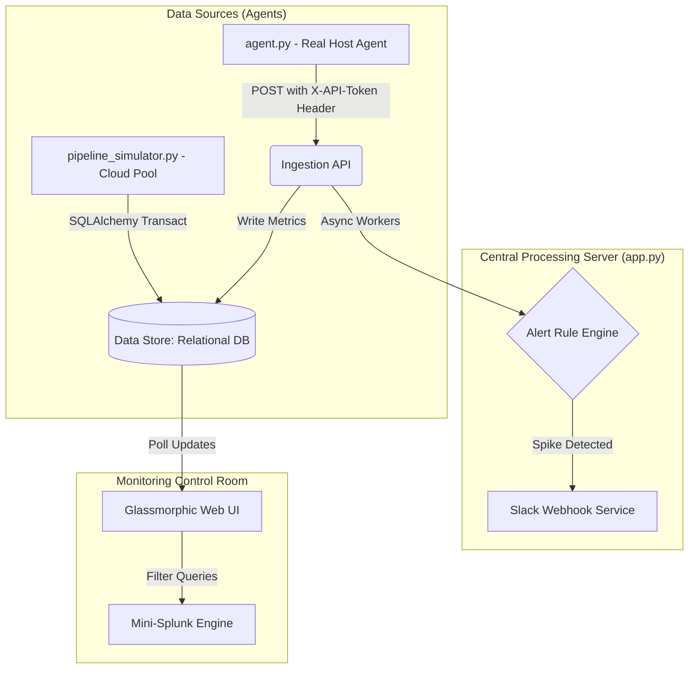

# Enterprise Cloud Infrastructure & Monitoring Pipeline (GCP, Azure, Python)

A high-performance, real-time log aggregation and telemetry pipeline designed to monitor multi-cloud infrastructure environments at scale (100GB+ daily). The system features a local telemetry collection daemon (agent), an ingestion API, and an interactive glassmorphic command center dashboard for incident alerting and triage.

---

## 🚀 Key Features

* **Multi-Cloud Simulation:** Models telemetry streams representing hybrid cloud resources across **GCP** (Pub/Sub, App Engine, Cloud SQL, BigQuery) and **Azure** (Event Hubs, App Service, SQL Server, Synapse).
* **Live System Monitoring Agent:** A lightweight daemon (`agent.py`) that uses kernel-level utilities to capture **actual real-time hardware performance metrics** (CPU, RAM, Disk I/O) from the host machine and streams them to the central collector.
* **Low-Latency Ingestion Engine:** Built using FastAPI with async event loops and background worker tasks to process high-throughput telemetry updates asynchronously.
* **Real-time Incident Alerting:** Automatic threshold evaluation (e.g. CPU > 50%, Memory > 85%) with state tracking to trigger notifications and support Slack webhook integrations.
* **TOC Command Dashboard:** An interactive, glassmorphic dark-theme monitoring console equipped with **Chart.js scrolling trend graphs** and a **Mini-Splunk Log Query Engine** to search, filter, and drill down on streaming logs.
* **API Token Security:** All telemetry and log ingestion endpoints are secured using custom header authentication (`X-API-Token`) to prevent spoofing or unauthorized posts.

---

## 🛠️ Architecture & Tech Stack



### Technical Stack Details
* **Language:** Python 3.9+ (utilizing `asyncio` for concurrency, `psutil` for hardware diagnostics, and `sqlalchemy` for database portability).
* **Server Framework:** **FastAPI** & **Uvicorn** (asynchronous ASGI server).
* **Frontend:** Vanilla HTML5, CSS3 (Glassmorphism design tokens), JavaScript (ES6 Fetch APIs), and **Chart.js** for animated metrics tracking.
* **Database:** SQLite (local development) / PostgreSQL (production-grade linked via SQLAlchemy engines).

---

## 📈 Scalability: Designing for 100GB+ Daily Datasets

In an enterprise environment, 100GB+ of daily log data equates to handling roughly **1,000 servers** generating **1MB of log files per minute** (approx. 70,000 messages/sec). To defend this scale in production, this pipeline architecture is designed to be upgraded as follows:

1. **Decoupled Buffer Ingestion:** HTTP endpoints are replaced with cloud-native message brokers (**GCP Pub/Sub** or **Azure Event Hubs**). These brokers act as high-speed shock absorbers to ingest bursts of logs without losing packets.
2. **Horizontal Compute Scaling:** The central processor runs inside Docker containers orchestrated by **Kubernetes (AKS/GKE)**. Pods automatically scale out horizontally based on queue latency or thread count.
3. **Massive Parallel Writes:** SQLite is swapped with **Apache Kafka Connect** which streams processed records in batches into partitioned column-oriented storage like **GCP BigQuery** or **Azure Synapse Analytics**.
4. **Local Disk Buffering:** In case of connection failure, the agent write-caches log payloads to local server disk buffers and flushes them in batches once connection is re-established.

---

## 🛠️ Edge Case Protections & Fault Tolerance

* **Alert De-duplication:** The pipeline enforces state-tracking in the database. When a threshold (like CPU) is breached, it checks if an active alert is already open. This prevents "alert fatigue" by ensuring operators aren't flooded with multiple duplicate notifications for a single continuous issue.
* **Database Compaction (Anti-bloat):** To prevent disk exhaustion during high-frequency ingestion, the pipeline executes a garbage-collection task every second, keeping only the most recent logs and metrics.
* **Graceful Network Failover:** If the central API becomes unreachable, the agent catches connection errors, gracefully backs off, and retries every 5 seconds instead of crashing.
* **Token Authentication:** Secure header validation (`X-API-Token: deloitte_secure_token_2026`) prevents malicious nodes on the local network from poisoning telemetry database tables.

---

## 🏃 Quick Start Guide

### 1. Installation
Clone the repository, enter the workspace directory, and install the dependencies:
```bash
pip install -r requirements.txt
```

### 2. Start the Central Pipeline Server
Launch the FastAPI uvicorn daemon:
```bash
python3 -m uvicorn app:app --host 0.0.0.0 --port 8000
```
*(Setting `--host 0.0.0.0` allows the server to accept connections from other computers on the same local network).*

### 3. Launch the Telemetry Agent
In a separate terminal window, start the system metrics harvester:
```bash
python3 agent.py
```

### 4. Deploying Remote Agents on Other Machines
To monitor actual remote servers or separate laptops on your network:
1. Copy `agent.py` to the target machine and install requirements (`pip install psutil requests`).
2. Update the config variables in `agent.py` on the target machine:
   ```python
   COLLECTOR_URL = "http://<YOUR_MAC_IP_ADDRESS>:8000"
   SERVER_ID = "srv-windows-rohith" # Unique name
   ```
3. Run the script on the target machine: `python agent.py`
4. The dashboard will automatically detect the new agent and add a static metrics card for it alphabetically!

### 5. Launching via Docker & PostgreSQL
To run the production-grade setup with isolated containers:
```bash
docker-compose up --build
```
